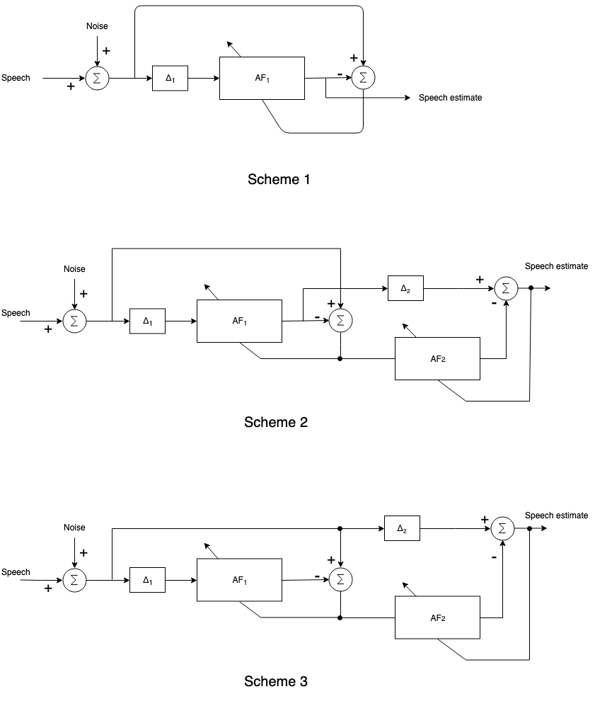

This repo implements a speech denoiser based on linear adaptive filtering. The denoiser is based on linear predictor that can estimate the narrow-band signals (eg. speech) from wide-band interference (eg. white noise). 

There are three denoising schemes implemented:

## Experimental Results

Six speech files were corrupted with white noise and pink noise at four different SNR levels: [-10dB, -3dB, 0dB, 3dB, 10dB]

The results are captured in the table below. The numbers in the table are the SNR boost from the de-noiser. It is measured by passing the speech only and noise only signals through the same path (through the learned adaptive filter weights); the output SNR is then computed from the power of the two output signals.

| scheme/condition   |          1 |         2 |         3 |
|--------------------|------------|-----------|-----------|
| pink_-10dB         | -0.766541  | -5.92294  | -5.5147   |
| white_0dB          |  4.60292   |  3.32892  | -0.125994 |
| white_3dB          |  5.14094   |  4.49858  |  0.100033 |
| pink_10dB          | -0.961484  | -1.97769  | -1.40649  |
| white_-3dB         |  4.82911   |  5.18377  |  0.867578 |
| pink_0dB           |  1.80714   |  1.71154  |  0.400853 |
| white_-10dB        | -0.0664928 | -5.59187  | -7.81915  |
| white_10dB         |  1.95156   |  0.652715 | -0.623954 |
| pink_-3dB          |  1.67194   |  2.30731  |  1.27683  |
| pink_3dB           |  0.829052  |  0.260178 | -0.411436 |
 
 To listen to the output of the denoiser under these different conditions, see the [out](../out) folder. 
 
 
This work was done as part of EE373: Adaptive signal processing with Dr. Widrow.